# Práctica 6.1 - Dockerización del Despliegue de una Aplicación con Node.js

## Despliegue con Docker

Primero deberemos de clonar el repositorio de GitHub https://github.com/raul-profesor/DAW_practica_6.1_2024.git

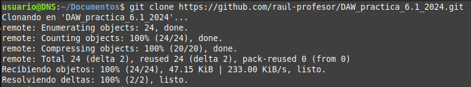

Ahora isntalamos Docker en nuestra máquina:

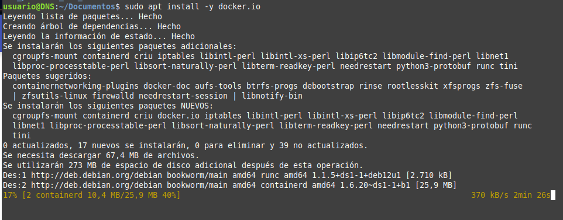

Ahora debemos de modificar el archivo `Dockerfile` para que construir la imagen de Docker:

img[3](includes/img/3.png)

Ahora debemos de construir la imagen de Docker, en nuestro caso librodirecciones:

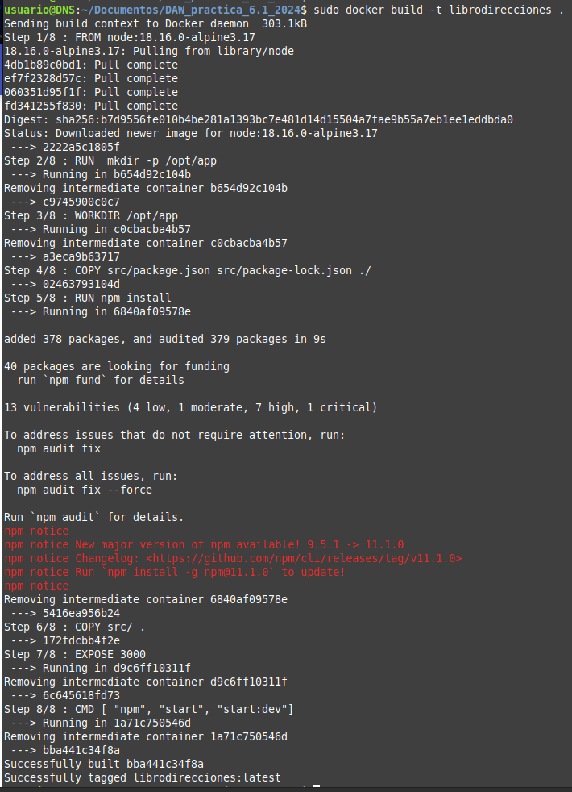

Inicio la imagen de Docker con el comando `sudo docker run -p 3000:3000 librodirecciones`:

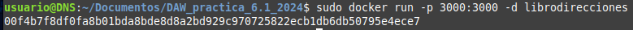

Vemos que la aplicación se ha iniciado correctamente:

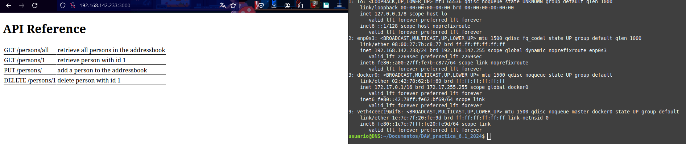

##  Docker Compose

Ahora primero antes de nada debemos de instalar Docker Compose:

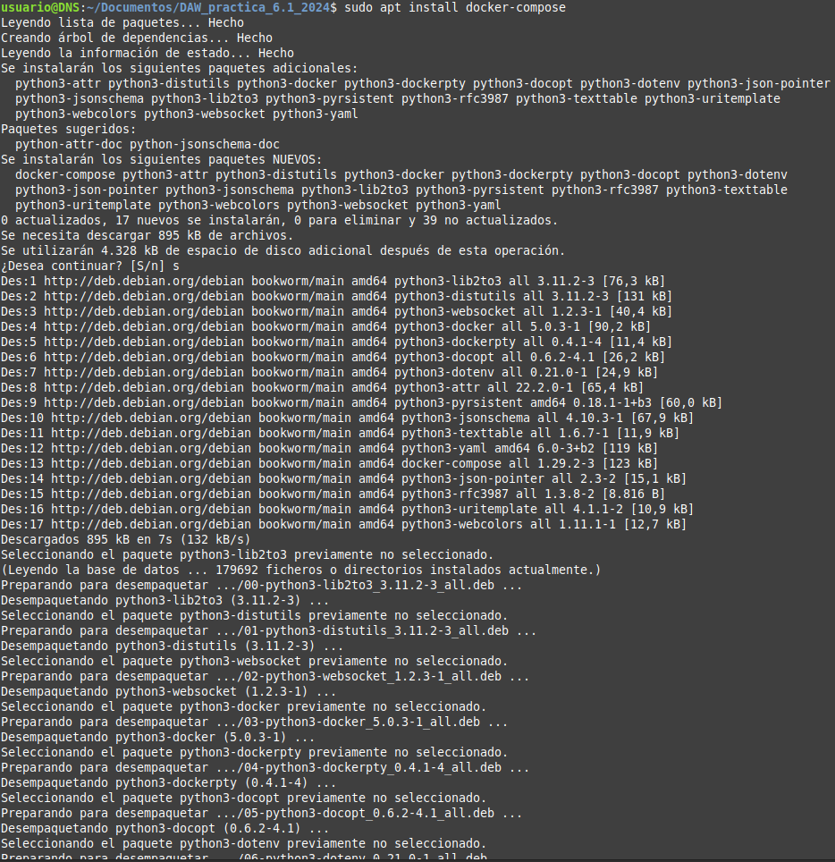

Comprobamos que se ha instalado correctamente:

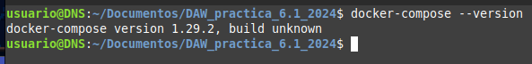

Ahora debemos de crear el archivo `docker-compose.yml`:

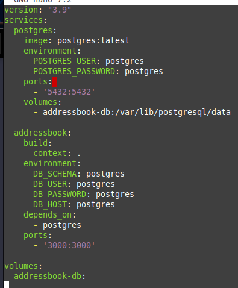

La parte de postgres es relativo a la base de datos que se va a utilizar, la cual va a estar montado en el puerto 5432.

La sección addressbook se encarga de construir la imagen de Docker usando el archivo `Dockerfile` y DB_HOST se establece
como el nombre del servicio de la base de datos.

Usar depends_on para asegurarse de que la base de datos se inicie antes de que se inicie la aplicación.

Ahora debemos de construir la base de datos:

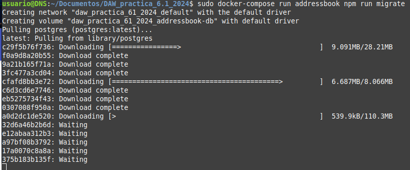

Ahora debemos de iniciar la aplicación con el comando `sudo docker-compose up --build -d`:

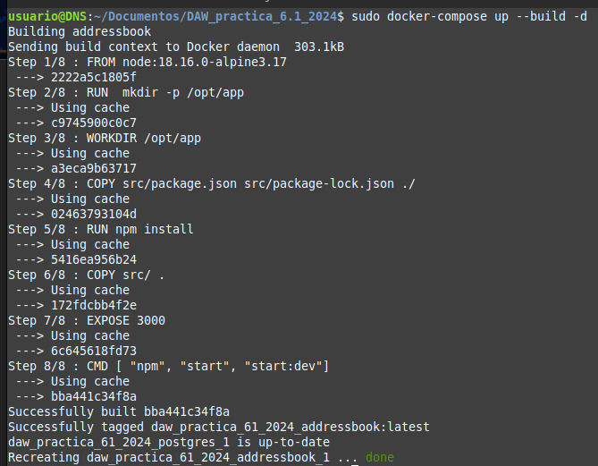

Se ejecuta el comando docker compose run addressbook npm run test para ver si la aplicación funciona correctamente:

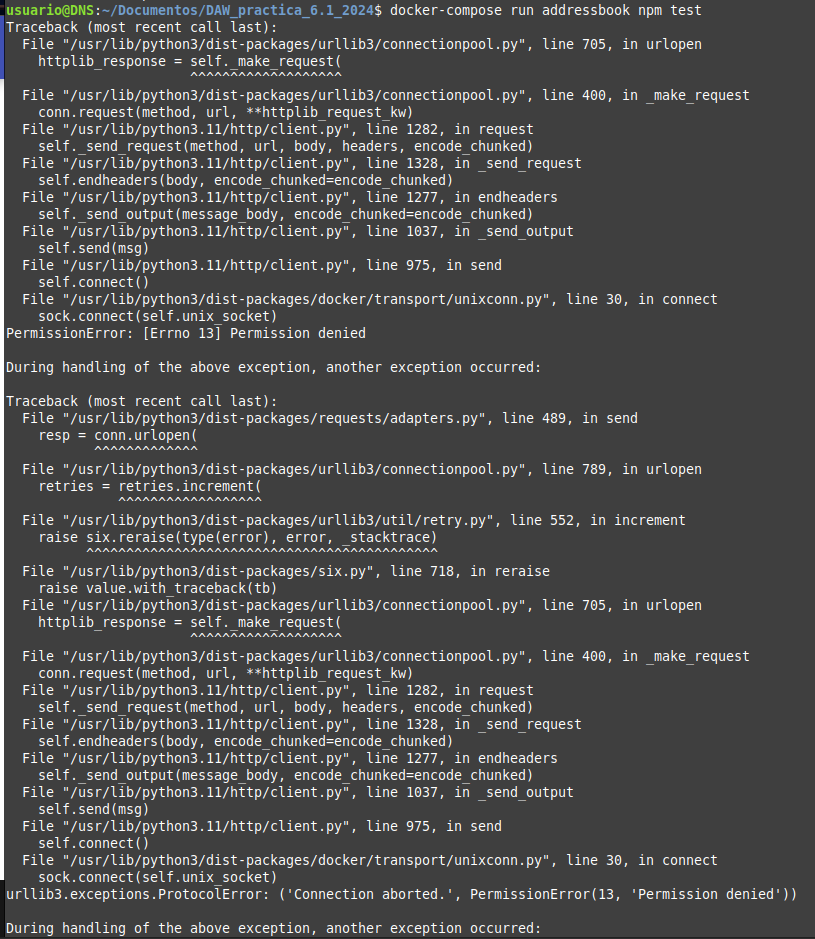

## Tarea

Se debe de probar la aplicación con la BBDD y la API:

- Añade una persona: curl -X PUT http://localhost:4000/persons -H 'Content-Type: application/json' -d '{"id": 1, "firstName": "Raúl", "lastName": "Profesor"}'

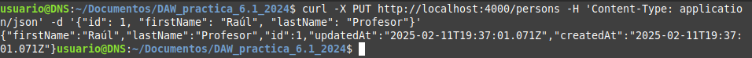

- Listar todas las personas:curl -X GET http://localhost:4000/persons/all -H 'Content-Type: application/json'

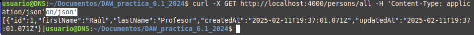

- Buscar una persona por ID: curl -X GET http://localhost:4000/persons/1 -H 'Content-Type: application/json'

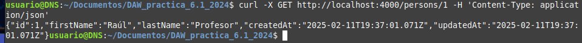

- Eliminar una persona: curl -X DELETE http://localhost:4000/persons/1 -H 'Content-Type: application/json'

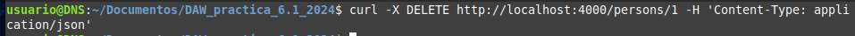

Debí de cambiar el puerto del adressbook en el archivo `docker-compose.yml` porque salía que el puerto estaba ya ocupado.
